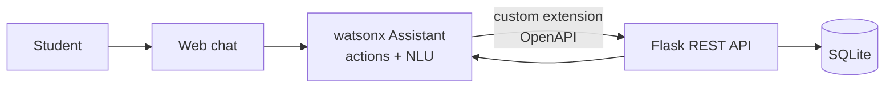

# CampusBot: Student Helpdesk Assistant (IBM watsonx Assistant)

A conversational assistant built with **IBM watsonx Assistant** that answers common student
questions and **automates a manual leave-approval process** through a Python/Flask REST API.

The project follows the pattern used in cognitive process automation: start from a written
**process definition**, then convert it into a conversational solution with API integration.

> Sample college data in this project is fictional ("Demo Campus").

## What it does

- Answers FAQs: fees, timings, contacts, exams, hostel, placements (7 FAQ actions + greeting/goodbye)
- **Apply for Leave**: collects details, validates them, and submits to the backend
- **Check Leave Status**: looks up a request by ID
- Applies business rules in the backend (auto-approve short leave, route longer leave to the HOD)
- Falls back gracefully when it does not understand

## Architecture



## Tech stack

watsonx Assistant (actions, custom extension, web chat) | Python 3 | Flask | SQLite | OpenAPI 3 | IBM Watson Python SDK | unittest

## Repository structure

```
assistant/
  intents.csv               all training phrases (phrase,action)
  example_phrases/          one CSV per action, ready to upload
  conversation_design.md    actions, responses, dialog flows
  process_definition.md     the manual process being automated + business rules
backend/
  app.py                    Flask REST API (create / track leave requests)
  test_api.py               unit tests (9 tests)
  openapi.yaml              API spec imported into watsonx Assistant
scripts/
  chat_cli.py               chat with the assistant from the terminal
  evaluate_intents.py       measures recognition accuracy on held-out phrases
  test_utterances.csv       30 test phrases not used in training
docs/screenshots/           add your screenshots here
```

## Setup

### 1. Run the backend

```bash
python -m venv .venv
source .venv/bin/activate        # Windows: .venv\Scripts\activate
pip install -r requirements.txt

cd backend
python -m unittest -v            # all tests should pass
python app.py                    # API on http://localhost:5000
```

Quick check:

```bash
curl -X POST http://localhost:5000/leave-requests \
  -H "Content-Type: application/json" \
  -d '{"student_id":"21CS1001","days":3,"from_date":"2026-10-12","reason":"Fever"}'
```

To protect the API, set `API_KEY` in your environment; requests then need an `X-API-Key` header.

### 2. Build the assistant in watsonx Assistant

Menu names can change between releases, so keep the
[IBM watsonx Assistant docs](https://cloud.ibm.com/docs/watson-assistant) open while you build.

1. Create an IBM Cloud account and a **watsonx Assistant** instance (use the free/Lite plan if offered), then create an assistant.
2. Create one **action** per row in `assistant/conversation_design.md`.
3. For each action, upload its phrases from `assistant/example_phrases/<action>.csv` as the example phrases ("customer starts with"), then add the response text from the design document.
4. Create the **Apply for Leave** and **Check Leave Status** flows exactly as described in the design document.

### 3. Connect the backend (custom extension)

1. Make your backend reachable from the internet (deploy it, or use a tunnel such as `ngrok http 5000` while testing).
2. Edit the `servers.url` in `backend/openapi.yaml` to your public URL.
3. In watsonx Assistant: Integrations -> **Build custom extension** -> import `openapi.yaml`, choose API key auth and add your `API_KEY`.
4. Add the extension to your assistant and call `createLeaveRequest` / `getLeaveRequest` from the two leave actions, mapping the response to action variables.

### 4. Test and evaluate

```bash
cp .env.example .env             # fill in your credentials
python scripts/chat_cli.py       # chat from the terminal
python scripts/evaluate_intents.py
```

`evaluate_intents.py` sends the 30 held-out phrases and reports accuracy.
If it reports 0%, run `python scripts/evaluate_intents.py --raw "hello"` to see the raw response
and adjust `triggered_names()` to match.

## Results

Fill this in after you run the evaluation (use your real numbers).

| Metric | Value |
|--------|-------|
| Actions | 10 |
| Training phrases | 120 |
| Held-out test phrases | 30 |
| Recognition accuracy | _your result_ |
| Backend unit tests | 9 passing |

## Screenshots

Add images to `docs/screenshots/` and reference them here, for example:

```

```

## Challenges and what I learned

Write 3-4 honest points here, for example: which actions were confused with each other and how
you fixed it by changing the example phrases, how you handled invalid input, and how you
connected the extension.

## Possible improvements

HOD approval screen, email/SMS notifications, real student database authentication, multilingual support (Telugu/Hindi).

## License

MIT
